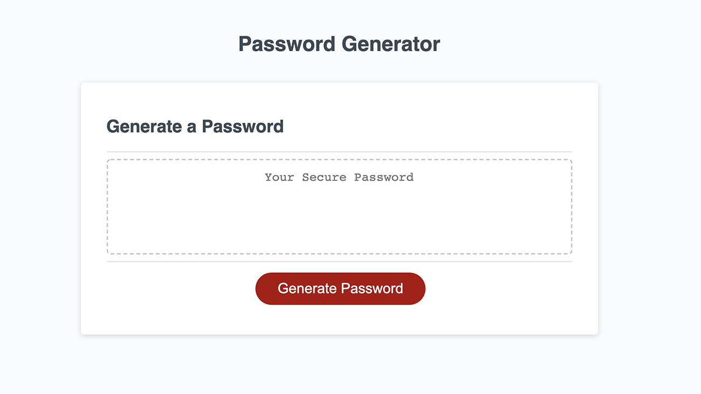
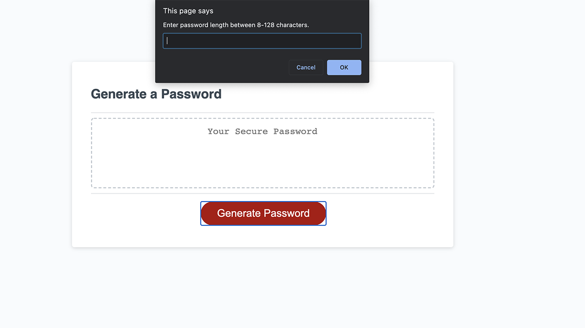
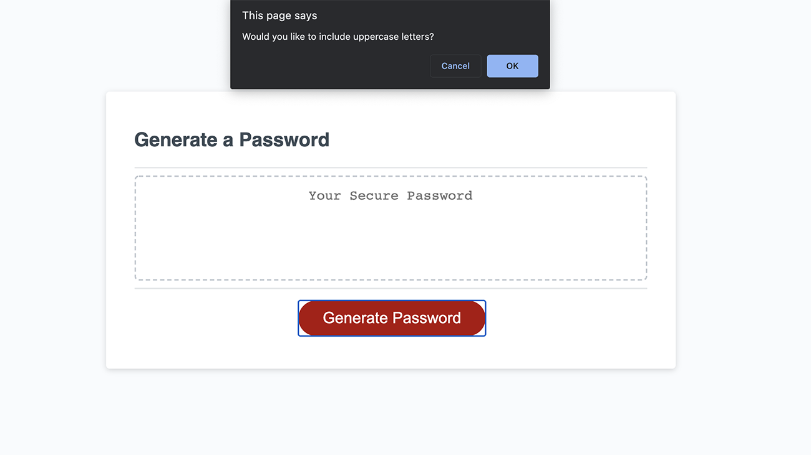
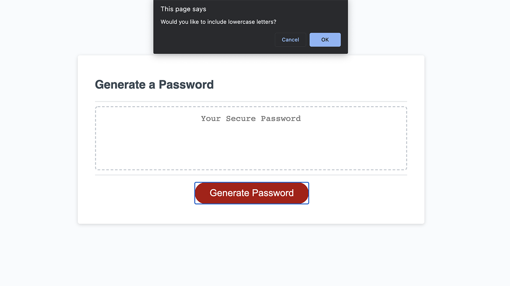
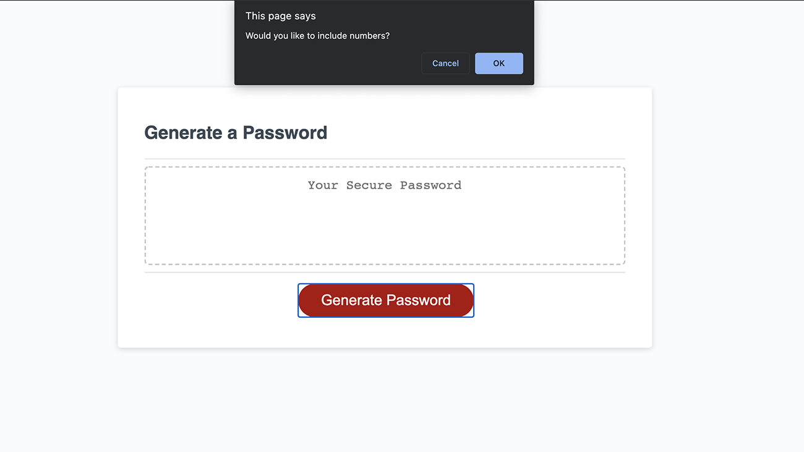
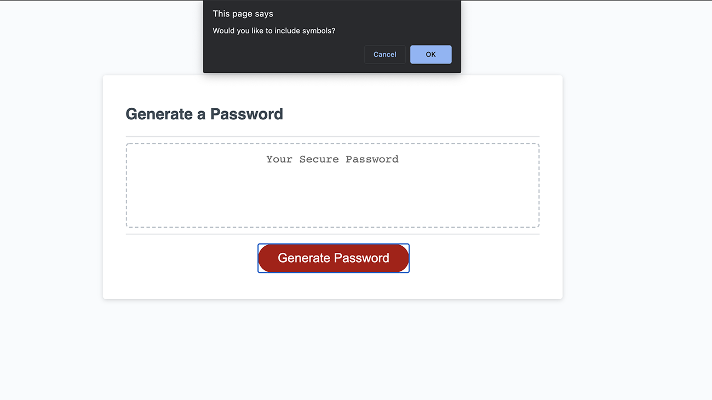
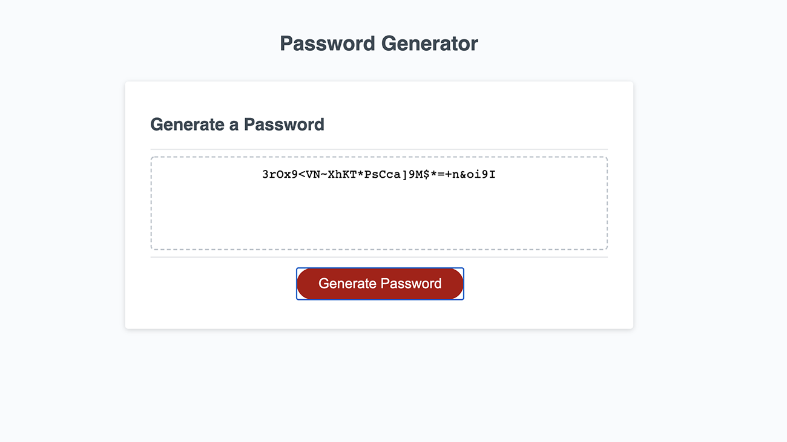

# Unique Password Generator

## Description
This application is intended for generating strong, unique passwords utilizing JavasScript fundamentals. Securing and protecting sensitive data is critical for anyone handling confidential infomation, from buisnesses dealing with client and sales data to the layperson managing online bank accounts. Gone are the days of assigning **password123** as your password because it's simple to conceive––This password generator solves the problem of weak passwords by selecting characters at random. 

## Deployed Application

[Deployed site](https://jareddeuriarte.github.io/password-generator/)

[GitHub Repo](https://github.com/jareddeuriarte/password-generator)

## Application
The following images show the web application's appearance and functionality:

## Features
Generates random password based on user specifications

The user's ability to choose:

    - Password length between 8-128 characters. 
    - Uppercase charachters inclusion
    - Lowercase characters inclusion
    - Numberic characters inclusion
    - Symbols inclusion

## Tests
Test the strenth of your generated password:
https://www.comparitech.com/privacy-security-tools/password-strength-test/

## Credits
JAMES NEWMAN THANK YOU SO MUCH FOR YOUR PATIENCE AND HELP! Also, Talyn Demi for the support and collaboration. 